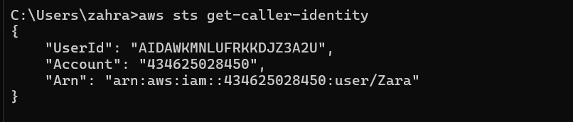
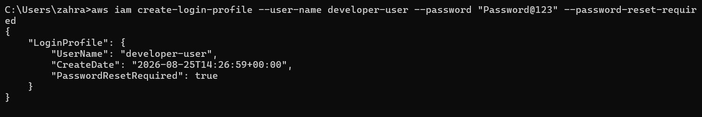
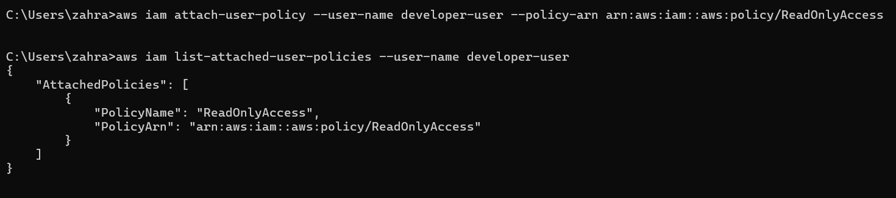
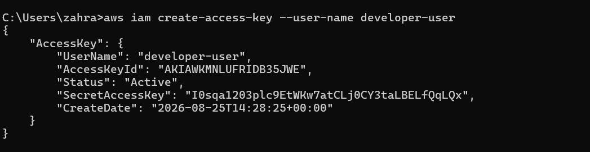
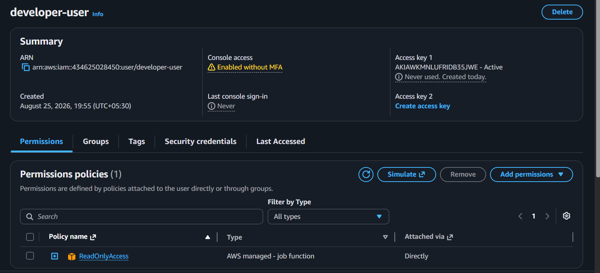

# AWS IAM User Management Using AWS CLI

## Project Overview

This project demonstrates how to create and manage AWS IAM users using the AWS Command Line Interface (CLI). The goal was to gain hands-on experience with Identity and Access Management (IAM), user creation, access key generation, and permission management without relying on the AWS Management Console.

## Objectives

- Configure AWS CLI
- Create an IAM user using CLI commands
- Verify user creation
- Generate programmatic access credentials
- Manage IAM permissions
- Understand AWS IAM security best practices

---

## Services Used

- AWS Identity and Access Management (IAM)
- AWS Command Line Interface (AWS CLI)

---

## Architecture

```text
Local Machine
     │
     ▼
 AWS CLI
     │
     ▼
 AWS IAM
     │
     ▼
 IAM User (developer-user)
```

---

## Step 1: Configure AWS CLI

Configured AWS CLI with IAM credentials and default region settings.

### Command

```bash
aws configure
```

---

## Step 2: Verify AWS Identity

Verified that AWS CLI was successfully connected to the AWS account.

### Command

```bash
aws sts get-caller-identity
```

### Screenshot

> Insert Screenshot: Caller Identity Verification


---

## Step 3: Create IAM User

Created a new IAM user named **developer-user** using AWS CLI.

### Command

```bash
aws iam create-user --user-name developer-user
```

### Output

```json
{
    "User": {
        "UserName": "developer-user",
        "Arn": "arn:aws:iam::<account-id>:user/developer-user"
    }
}
```

### Screenshot

> Insert Screenshot: Successful User Creation


---

## Step 4: Verify User Creation

Confirmed that the IAM user was successfully created.

### Command

```bash
aws iam get-user --user-name developer-user
```

### Screenshot

> Insert Screenshot: User Verification


---

## Step 5: Create Login Profile

Created a console login password for the IAM user.

### Command

```bash
aws iam create-login-profile \
--user-name developer-user \
--password "********" \
--password-reset-required
```

### Screenshot

> Insert Screenshot: Login Profile Creation



---

## Step 6: Attach IAM Policy

Granted the user ReadOnly access using an AWS managed policy.

### Command

```bash
aws iam attach-user-policy \
--user-name developer-user \
--policy-arn arn:aws:iam::aws:policy/ReadOnlyAccess
```

### Verification

```bash
aws iam list-attached-user-policies --user-name developer-user
```

### Screenshot

> Insert Screenshot: Policy Attachment



---

## Step 7: Generate Access Keys

Created programmatic access credentials for the IAM user.

### Command

```bash
aws iam create-access-key --user-name developer-user
```

### Security Note

⚠️ Access keys should never be exposed publicly. Store them securely and rotate them regularly.

### Screenshot

> Insert Screenshot: Access Key Creation (Hide Secret Access Key)



---

## Step 8: Verify User in AWS Console

Verified the newly created IAM user from the AWS Management Console.

### Screenshot

> Insert Screenshot: IAM User in AWS Console



---

## Key Learnings

- AWS IAM fundamentals
- User creation through AWS CLI
- IAM policy attachment and permission management
- Access key generation and security practices
- AWS identity verification using STS
- CLI-based AWS administration

---

## Security Best Practices

- Follow the principle of least privilege.
- Rotate access keys regularly.
- Avoid using root account credentials.
- Use IAM policies to control access.
- Never expose secret access keys in code repositories or screenshots.

---

## Project Outcome

Successfully created and managed an AWS IAM user using AWS CLI, assigned permissions, generated programmatic access credentials, and verified user access through both CLI and AWS Console.

This project demonstrates practical AWS IAM administration skills and foundational cloud security concepts used in real-world AWS environments.